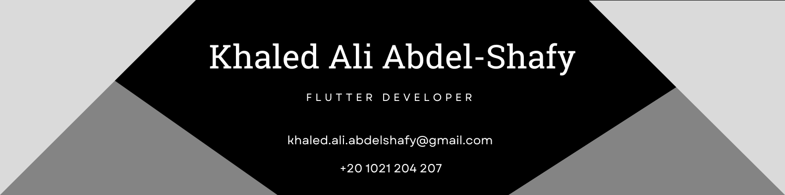

<h2 align="left">Hello World!, I'm Khaled, a Mobile Developer 👋🏼</h2>

## 🌐 Socials:

  
  <a href="https://www.youtube.com/channel/UCXPaAUoKool7-O9Qzv3TYJg" target="_blank">
    
 
  </a>
  
  

# 💻 Tech Stack:

               

###

<picture>
  <source media="(prefers-color-scheme: dark)" srcset="https://raw.githubusercontent.com/tobiasmeyhoefer/tobiasmeyhoefer/output/github-snake-dark.svg" />
  <source media="(prefers-color-scheme: light)" srcset="https://raw.githubusercontent.com/tobiasmeyhoefer/tobiasmeyhoefer/output/github-snake.svg" />
  
</picture>
